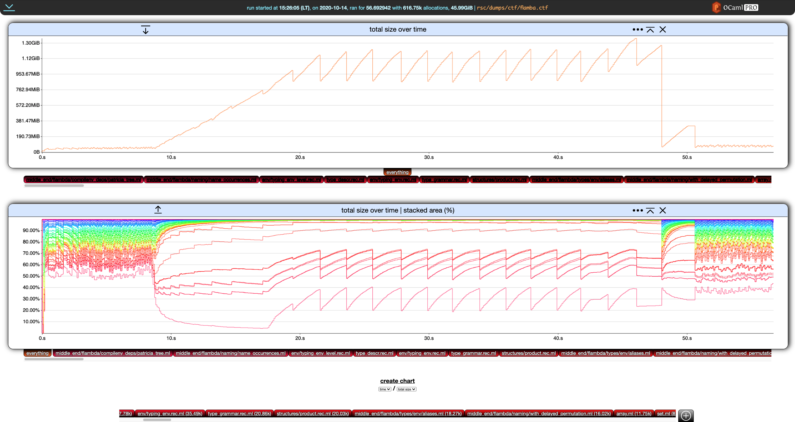

Memthol is a visualizer for memory profiling data generated from [OCaml] programs.


# Resources

- [Official page][memthol] 
- [API documentation][doc]
- [Memthol's small tutorial][tuto]


# Features

- [x] multi-client: open several tabs in your browser for the same profiling session to visualize
    the data separately
- [x] self-contained: the BUI packs all its static assets, once you have the binary you do not need
    anything else (except a browser)
- [x] data-splitting: plot several families of data separately in the same chart by separating them
    based on size, allocation lifetime, source locations in the allocation callstack, *etc.*
- [ ] multiple metrics to plot different kinds of data: allocation lifetime, size, time of creation,
    *etc.*
- [ ] flamegraphs


# What It Looks Like




# Browser Compatibility

Memthol is mostly tested on the Chrome web browser. You might experience problems with other
browser, in which case we recommend you open an [issue][memthol issues].


# Dump Files

Memthol's current official input format is memory dumps produced by [*Memtrace*][memtrace] ([on
github][memtrace git]). A memtrace dump for a program execution is a single [**C**ommon **T**race
**F**ormat](https://diamon.org/ctf) (CTF) file.

Note that this repository contains a minimal Memtrace example in [`rsc/memtrace_example`][memtrace
example].


# Build

## Pre-requisites

Since memthol's UI is browser-based, it has a client written in [Rust] that compiles to [web
assembly] (wasm). To do this, you need to have the [rust toolchain].

- add the wasm target for rustup:

    ```bash
    rustup target add wasm32-unknown-unknown
    ```

- make sure everything is up to date with

    ```bash
    rustup update
    ```

- make sure you have [wasm-pack] installed so that Rust can compile the client

    installation instructions [here][install wasm-pack], although `cargo install wasm-pack` should
    work

- install [`cargo-make`][cargo make] with `cargo install cargo-make`

Memthol UI's dependencies rely on some OS-level packages. Please make sure they are installed and in
your path:

- build essentials (including `cmake`)
- openssl/libssl
- freetype
- expat

## `debug`

> **NB**: memthol is quite slow in `debug` mode. If you have a lot of data to process, definitely
> build in release instead.

To build memthol in `debug` mode, run

```bash
cargo make build
```

The memthol binary will be in `target/debug/memthol`

### `release`

To build memthol in `release` mode, run

```bash
cargo make release
```

The memthol binary will be in `./memthol_ui`, also available as `target/release/memthol`.

# Testing

Run memthol-ui on the test files located on this repository, in `rsc/ctf/mini_ae.ctf` to make sure
it works. Assuming your binary is called `memthol` and is in you path, and you are at the root of
this repository:

```bash
memthol rsc/dumps/ctf/mini_ae.ctf
```

There is a bigger set of data you can use for testing, although we recommend you build in `release`
mode for this one:

```bash
memthol rsc/dumps/ctf/flambda.ctf
```

# Icons

Most icons used in memthol come from the [bootstrap library][bootstrap].

[memthol]: https://ocamlpro.github.io/memthol/ (Memthol site)
[doc]: https://ocamlpro.github.io/memthol/doc/memthol (Documentation site)
[OCaml]: https://ocaml.org/ (OCaml official page)
[web assembly]: https://webassembly.org/ (Web Assembly official page)
[Rust]: https://www.rust-lang.org/ (Rust official page)
[rust toolchain]: https://www.rust-lang.org/tools/install (Rust installation instructions)
[wasm-pack]: https://crates.io/crates/cargo-web (Cargo-web on crates.io)
[tuto]: https://ocamlpro.github.io/memthol/mini_tutorial/ (Memthol's tutorial on github pages)
[install wasm-pack]: https://rustwasm.github.io/wasm-pack/installer (wasm-pack install instructions)
[bootstrap]: https://icons.getbootstrap.com (the bootstrap library)
[cargo make]: https://crates.io/crates/cargo-make (cargo-make on crates.io)
[memtrace]: https://blog.janestreet.com/finding-memory-leaks-with-memtrace
(Blog post: Finding Memory Leaks With Memtrace)
[memtrace git]: https://github.com/janestreet/memtrace
(Memtrace on github.com)
[memtrace example]: ./rsc/memtrace_example
[memthol repo]: https://github.com/OCamlPro/memthol (Memthol github repository)
[memthol issues]: https://github.com/OCamlPro/memthol/issues
(Issues on the Memthol github repository)