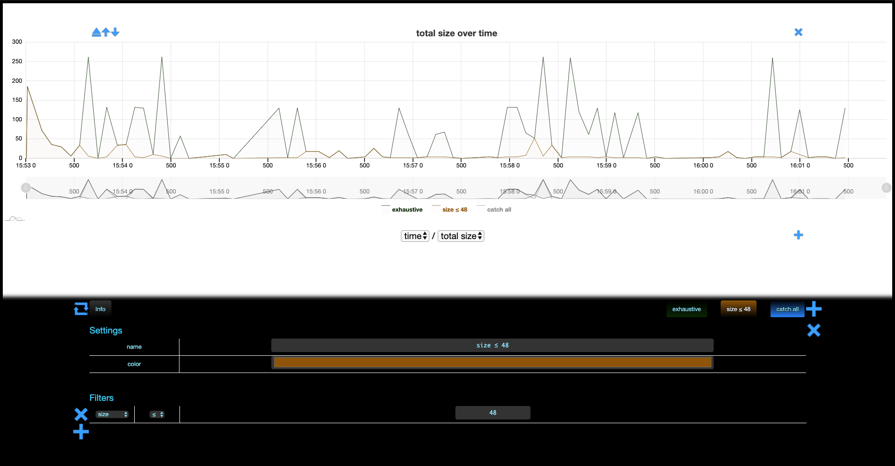

# Filters

<!-- 

colors:

- exhaustive: 002C01
- new filter: F0EA79
 -->

Memthol lets users create filters that *catch*, or *match*, different allocations. Let's create one by clicking on the *add* `+`-button of the filter footer.

This just created the currently selected filter *"new filter"*. The color is randomly generated so
it will very probably be different for you. We see the same customization options we played with
previously with the *everything filter*, and we also see that the *new filter* tab has `*`
characters around the name, indicating nothing has been applied yet.

Notice also the new *"catch all"* filter. We will discuss it shortly.

\
\

In the settings of the *new filter*, there is a *filters* subsection with another *add* `+`-button.
This buttons lets us specify the allocations we want this *new filter* to catch by writing
conditions. Let's click on it.

This creates a new row three columns, which are

- the metric of the condition, `size` by default
- an operator over the metric, `=` by default
- arguments for the operator, `0` by default

\
\

So, this fresh condition will match on allocations if their size is equal to `0`. That's not very
interesting, let change it so that it matches on allocations smaller than `48` bytes by changing the
operator and its argument. Let's also change the name of the filter to something more informative
(and its color).

\
\

Finally, we save our modifications and get the following.

\
\

The result is not extremely readable... Let's fix this by first noticing that the graph now has a
legend featuring a key for each of our three filters. Clicking on a filter key (de)activates, so
let's deactivate *catch all* since for now we don't even know what it is.

\
\

Much better.