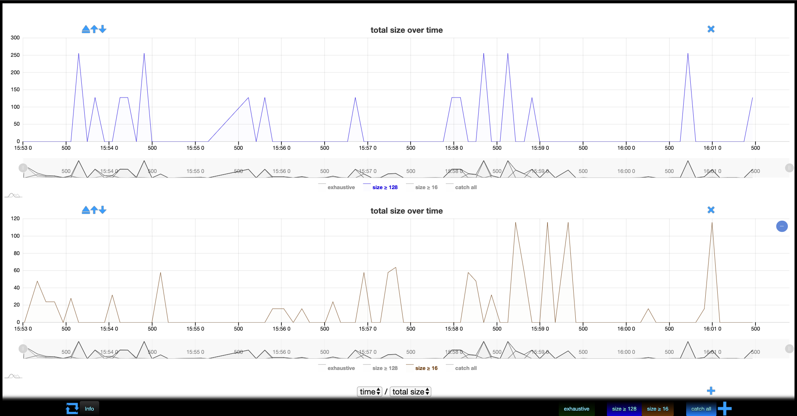

# Graphs

If you need to write many filters, it can become tedious to keep on (de)activating what you (don't)
need to obtain a readable graph. This is why memthol lets you create as many graphs as you need so
that you can switch between different (combinations of) filters simply by looking at a different
graph.

\
\

At the bottom of the main window contain our only graph, you can see a `time / total size` label
followed (on the far right) by an *add* `+`-button. Clicking on that button creates a new graph.

\
\

Let's have each of the two graphs we have now show only one of our custom filters. This is done
exactly the same way we (de)activated graph previously, by clicking the appropriate key(s) of the
legend of each graph.

\
\

Now, depending on your use-case and/or personnal preferences, having graphs with different scales
might make analyzing the data difficult. Thankfully, the *everything* filter can normalize these
scales for you so that comparing graphs is more convenient.

Let's try activating the *everything* filter on both graphs. For readability, we changed its color
to a less eye-catching one.

\
\

Let's conclude this section with graph actions. Each graph has a title that will be customizable
eventually. On the far right of the title is a *close* button (looks like a cross) that discards the
graph. On the far left are three buttons. From left to right:

- collapse/expand: hide/reveal graph
- move up (up arrow): move graph up
- move down (down arrow): move graph down
