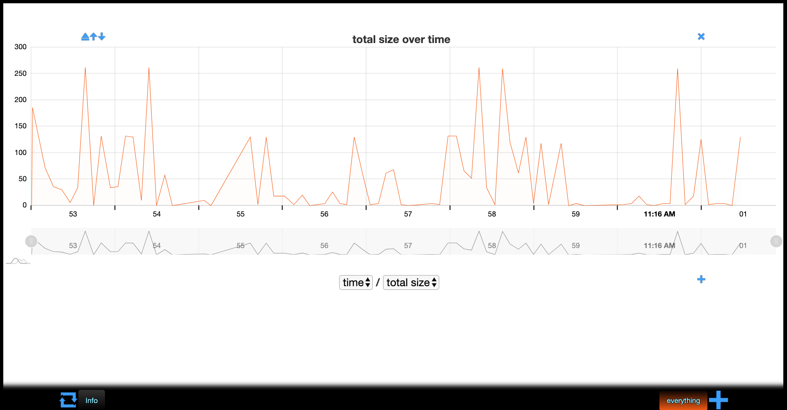
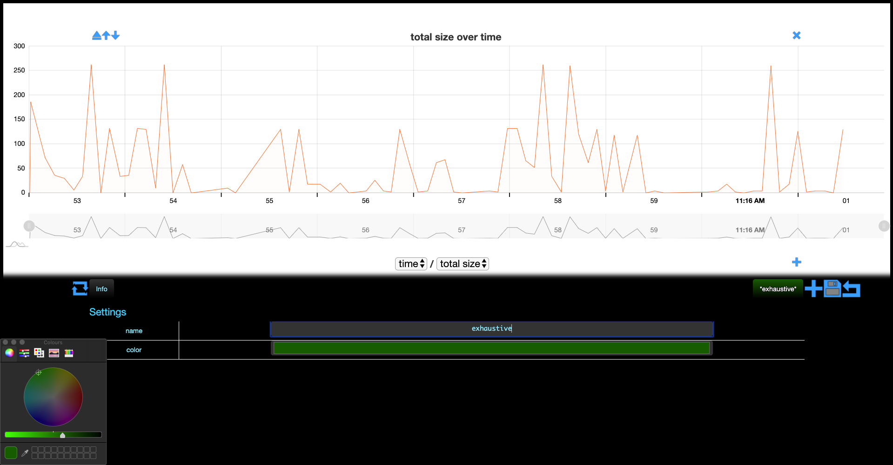
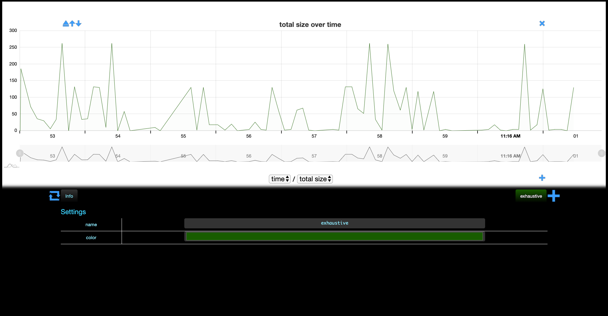

# Basics

Once memthol is running, then `http://localhost:7878/` will lead you to memthol's BUI, which will
look something like this:

The (only) graph shown here displays the sum of the sizes of the allocations (in bytes) over time.

\
\

At the bottom is the so-called *filter footer*, which is collapsed by default. It only features one
filter right now, the *everything* filter. Clicking on it expands its options and allows for some
(cosmetic) customization.

\
\

Notice the *add* button (that looks like a `+`) in the top-right corner of the footer. We will
discuss it later. For now, let's change the name and color of this filter.

> **NB:** the color palette is provided by the Operating System, the one shown here is provided by
> macos. It will look different on other systems.

\
\

Nothing changed in the graph, but two buttons have appeared in the top-right corner of the footer. A
*save* button (floppy disk) and an *undo* button (arrow going backwards).

Also, the *everything* tab changed to our new name, *"exhaustive"* surrounded by `*` characters.
This indicates that the changes we made have not been applied. We can undo the changes in the filter
footer with the undo button, or save/commit/apply them with the save button.

Let's save these changes.

The changes have now been applied to the graph and the *save* and *undo* buttons are gone. Note that
currently you cannot undo changes once you have saved them. (Except by reloading the page and going
back to the original layout and settings.)

\
\

Clicking on the (now) *exhaustive* tab again collapses the filter footer.

\
\

The *everything* (now called *exhaustive*) filter always contains all the allocations of the
program's execution over time. More precisely, it contains all the allocations contained in the dump
files. Next, let's build filters that partition these allocations.