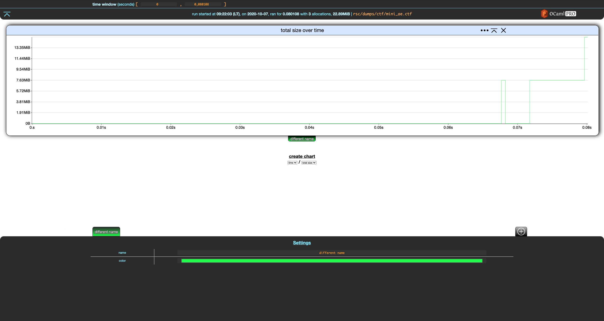
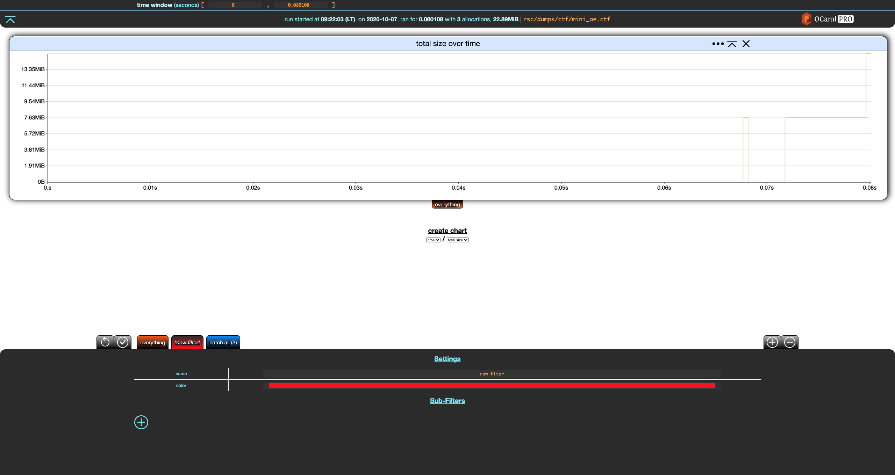
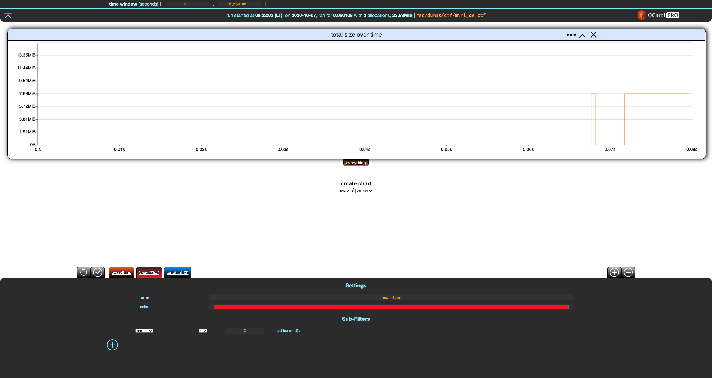

# Basics

Our running example in this section will be `rsc/dumps/mini_ae.ctf`:

```bash
❯ ls rsc/dumps/ctf/mini_ae.ctf
rsc/dumps/ctf/mini_ae.ctf

❯ memthol rsc/dumps/ctf/mini_ae.ctf
|===| Starting
| url: http://localhost:7878
| target: `rsc/dumps/ctf/mini_ae.ctf`
|===|

```

Once memthol is running, `http://localhost:7878/` (here) will lead you to memthol's BUI, which
should look something like this:


Click on the orange **everything** tab at the bottom left of the screen.


Memthol's interface is split in three parts:

- the central, main part displays charts. There is only one here, showing the evolution of the
  program's total memory size over time based on the memory dump.

- the header gives statistics about the memory dump and handles general settings. There is currently
  only one, the *time window*.

- the footer controls your *filters* (there is only one here), which we are going to discuss right
  now.


## Filters

*Filters* allow to split allocations and display them separately. A filter is essentially a set of
allocations. Memthol has two built-in filters. The first one is the **everything** filter. You
cannot really do anything with it except for changing its name and color using the filter settings
in the footer.


Notice that when a filter is modified, two buttons appear in the top-left part of the footer. The
first reverts the changes while the second one saves them. Let's save these changes.



The **everything** filter always contains all allocations in the memory dump. It cannot be changed
besides the cosmetic changes we just did. These changes are reverted in the rest of the section.

Let's create a new filter using the `+` add button in the top-right part of the footer.



Notice that, unlike **everything**, the settings for our new filter have a `Sub-filter` (empty)
section with a `+` add button. Let's click on that.



The (only) graph shown here displays the sum of the sizes of the allocations (in bytes) over time.

\
\

At the bottom is the so-called *filter footer*, which is collapsed by default. It only features one
filter right now, the *everything* filter. Clicking on it expands its options and allows for some
(cosmetic) customization.


\
\

Notice the *add* button (that looks like a `+`) in the top-right corner of the footer. We will
discuss it later. For now, let's change the name and color of this filter.


> **NB:** the color palette is provided by the Operating System, the one shown here is provided by
> macos. It will look different on other systems.

\
\

Nothing changed in the graph, but two buttons have appeared in the top-right corner of the footer. A
*save* button (floppy disk) and an *undo* button (arrow going backwards).

Also, the *everything* tab changed to our new name, *"exhaustive"* surrounded by `*` characters.
This indicates that the changes we made have not been applied. We can undo the changes in the filter
footer with the undo button, or save/commit/apply them with the save button.

Let's save these changes.


The changes have now been applied to the graph and the *save* and *undo* buttons are gone. Note that
currently you cannot undo changes once you have saved them. (Except by reloading the page and going
back to the original layout and settings.)

\
\

Clicking on the (now) *exhaustive* tab again collapses the filter footer.


\
\

The *everything* (now called *exhaustive*) filter always contains all the allocations of the
program's execution over time. More precisely, it contains all the allocations contained in the dump
files. Next, let's build filters that partition these allocations.