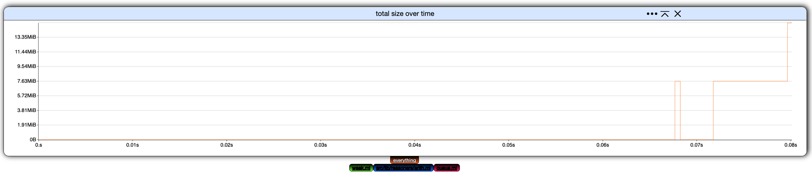
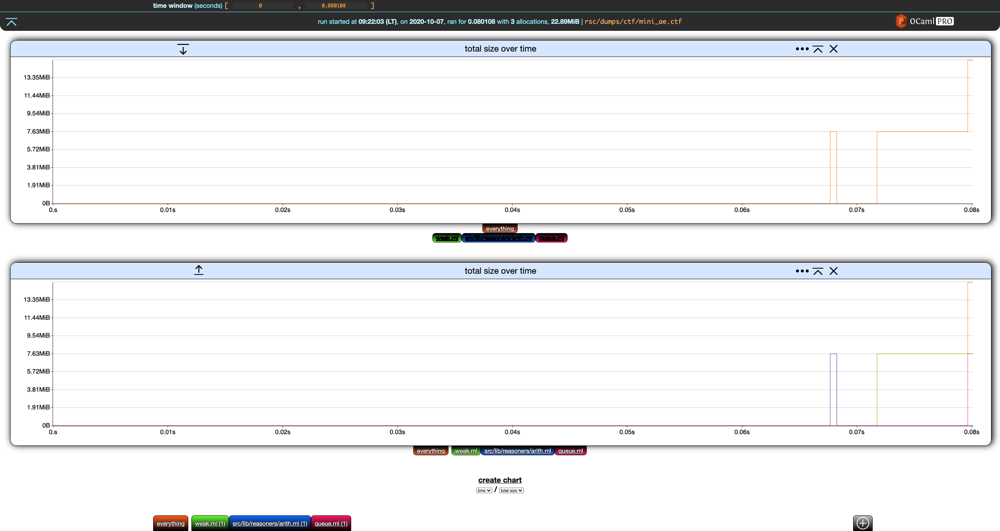
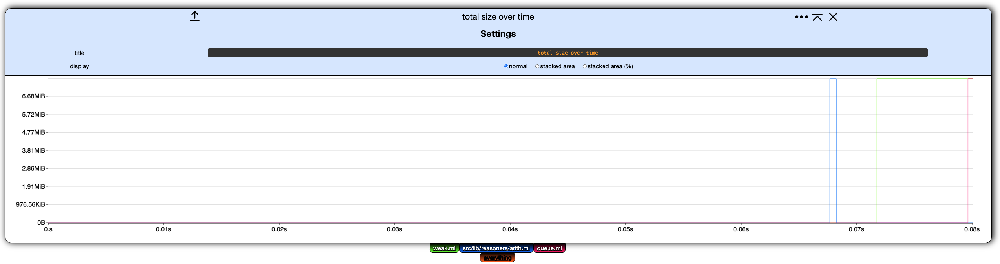

# Charts

This section uses the same running example as the last section.

```bash
❯ memthol rsc/dumps/ctf/mini_ae.ctf
|===| Starting
| url: http://localhost:7878
| target: `rsc/dumps/ctf/mini_ae.ctf`
|===|

```

## Filter Toggling

The first way to interact with a chart is to (de)activate filters. Each chart has its own filter
tabs allowing to toggle filters on/off.

From the initial settings


click on all filters but **everything** to toggle them off.



\
\

Let's create a new chart. The only kind of chart that can be constructed currently is total size
over time, so click on **create chart** below our current, lone chart.



\
\

Deactivate **everything** in the second chart.


Nice. We now have the overall total size over time in the first chart, and the details for each
filter in the second one.

\
\

Next, notice that both charts have, on the left of their title, a down (first chart) and up (second
chart) arrow. This moves the charts up and down.

On the right of the title, we have a settings `...` buttons which is discussed
[below](#chart-settings). The next button collapses the chart. If we click on the *collapse* button
of the first chart, it collapses and the button turns into an *expand* button.


\
\

The last button in the chart header removes the chart.


## Chart Settings

Clicking the settings `...` button in the header of any chart display its settings. (Clicking on the
button again hides them.)



Currently, these chart settings only allow to rename the chart and change its **display mode**.


### Display Mode

In memthol, a chart can be displayed in one of three ways:

- normal, the one we used so far,

- stacked area, where the values of each filter are displayed on top of each other, and

- stacked area percent, same as stacked area but values are displayed as percents of the total.

\
\

Here is the second chart from our example displayed as stacked area for instance:


