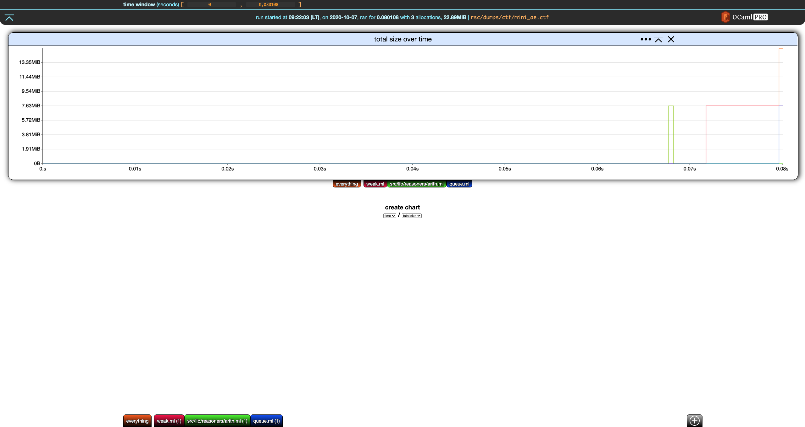
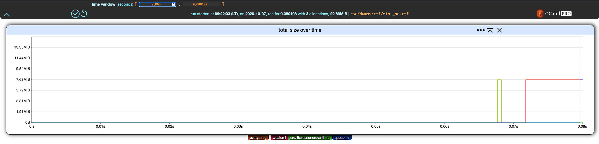

# Global Settings

This section uses the same running example as the last section.

```bash
❯ memthol rsc/dumps/ctf/mini_ae.ctf
|===| Starting
| url: http://localhost:7878
| target: `rsc/dumps/ctf/mini_ae.ctf`
|===|

```

\
\

There is currently only one global setting: the *time window*.

## Time Window

The *time window* global setting controls the time interval displayed by all the charts.

In our example,



not much is happening before (roughly) `0.065` seconds. Let's have the time window start at that
point:



\
\

Similar to filter edition, we can apply or cancel this change using the two buttons that appeared in
the bottom-left corner of the header.

Saving these changes yields


\
\

Here is the same chart but with the time window upper-bound set at `0.074`.


