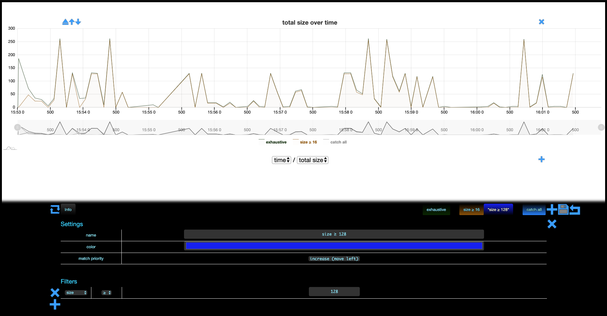
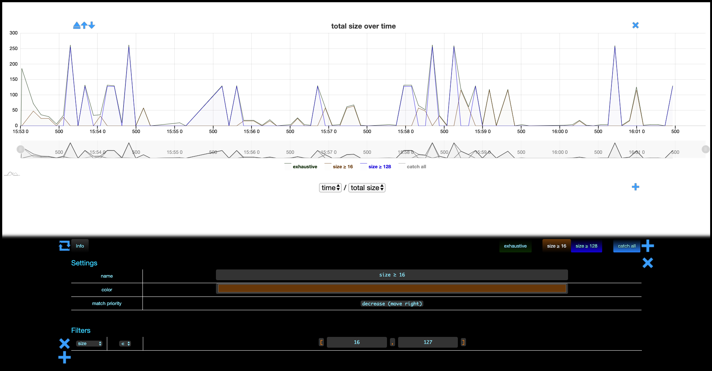

# More Filters

<!-- 

colors:

- exhaustive: 002C01
- size ≥ 16: 763E01
- size ≥ 128: 0022DF
 -->

Say we're interested in *"big"* allocations. Let's change our filter to catch allocations bigger
than `16` bytes and save it right away.

\
\

Not very informative, let's create another filter to catch allocation bigger than `128` bytes so
that *"very big"* allocations (≥ `128` bytes) are separated from *"medium-size"* allocations
(between `16` and `128` bytes).

Before we save our new filter:

\
\

After we save it:

\
\

That's somewhat disappointing, nothing happened. If we look closely, we see that `size ≥ 128` is `0`
everywhere. Why?

\
\

It turns out filters in memthol are akin to if-then-else-s (or pattern-matching) in programming.
That is, a given allocation belongs to the first filter (from left to right) that catches it. Since
our first filter catches everything bigger than `16` bytes, there is no allocation bigger than `128`
bytes for the second filter to catch.

\
\

A first solution is to refine the first filter. One way to do this is to add a condition that
allocations should be smaller than or equal to `127` bytes.

We can achieve the same result more concisely using the `⋲` operator which takes two arguments
(lower and upper bound).

> **NB:** memthol will **not** let you write illegal intervals for the `⋲` operator. Make sure you
> modify bounds in the right order to produce legal intervals. The default interval being `[0, 0]`,
> prefer editing the upper-bound first (`[0, 127]`) and then the lower-bound (`[16, 127]`), as doing
> the opposite (`[16, 0]` and then `[16, 127]`) will create an illegal interval (`[16, 0]`).

\
\

However, it is arguably more natural to just re-order the filters so that the more specific *"size ≥
`128`"* preceeds the more generic *"size ≥ 16"*. When we created the second filter, you may have
noticed that a *"match priority"* row appeared in the settings. This row is only visible when there
are more than one filter, and allows

- to *decrease* the priority of the first filter (move right)
- to *increase* the priority of the last filter (move left)
- to either increase or decrease the priority of the other (inner) filters, if any.

Hence, we can just leave *"size ≥ 16"* as it was before and *decrease* its priority.

\
\

Last, let's discuss the *"catch all"* filter we put aside at the beginning. As you probably guessed
by now, this filter catches everything not caught by your filters. Here, for instance, we can
deactivate all filters except *catch all* to see if our filters are missing some allocations.

Which they are of course, they are missing all allocations (strictly) smaller than `16` bytes.

\
\

The *catch all* filter is similar to the *everything* filter in that you cannot change anything
about it except the way it looks.
